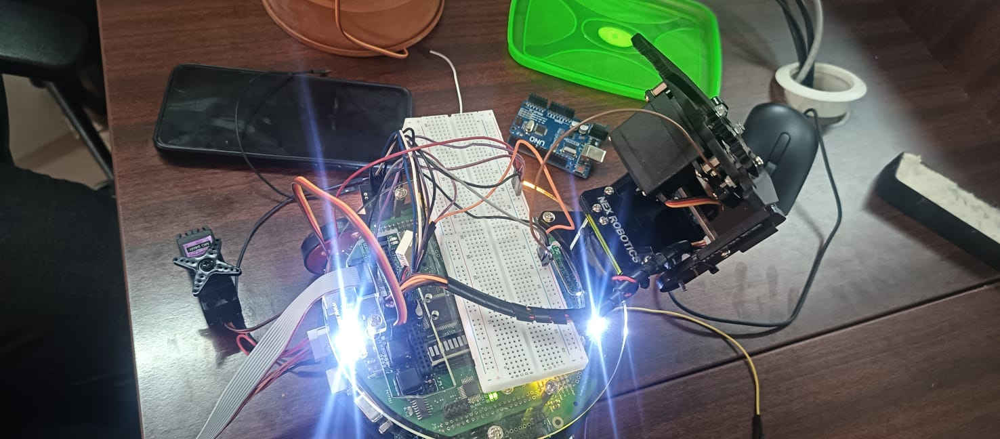

# Waste-Segregation Robot Using ATmega2560


This project implements a waste segregation robot using the ATmega2560 microcontroller. The robot utilizes a color sensor to detect the color of the waste and segregate it into appropriate categories.

---

## 🚀 Features

- **Color Detection**: Uses a color sensor to identify waste types.
- **LCD Display**: Displays real-time waste categorization information.
- **Efficient Sorting**: Helps automate waste management tasks.

---

## 📂 Project Structure

```
Waste-Segregation-Robot-Using-Atmega2560/
├── Debug/
│   ├── Color Sensor.d
│   ├── Color Sensor.eep
│   ├── Color Sensor.elf
│   ├── Color Sensor.lss
│   ├── Color Sensor.o
│   ├── Color Sensor.srec
│   ├── makedep.mk
│   └── Makefile
├── Color Sensor.cpp
├── Color Sensor.cppproj
├── firebird_avr.h
├── lcd.h
├── LICENSE
└── README.md
```

---

## 🔧 Dependencies

- AVR-GCC Toolchain
- AVRDUDE
- ATmega2560 Microcontroller
- Atmel Studio 6.1 or later

---

## 📖 Setup

1. Clone the repository.
2. Open the project in Atmel Studio 6.1 or later.
3. Ensure that the AVR-GCC toolchain is installed and configured in Atmel Studio.

---

## 🔨 Building the Project

1. Open Atmel Studio.
2. Navigate to `File -> Open -> Project/Solution` and select `Color Sensor.cppproj`.
3. Build the project by navigating to `Build -> Build Solution` or pressing `F7`.

---

## 🚀 Flashing the Microcontroller

To flash the compiled binary to the ATmega2560 microcontroller, run:

```sh
avrdude -c <ATMEGA> -p m2560 -U flash:w:Debug/Color\ Sensor.hex
```

---

## 🖊️ Source Code Overview

### Key Functions in `Color Sensor.cpp`

- `lcd_port_config()`: Configures the LCD port.
- `color_sensor_pin_config()`: Configures the color sensor pins.

#### Code Snippet

```cpp
#define F_CPU 14745600
#include <avr/io.h>
#include <avr/interrupt.h>
#include <util/delay.h>
#include <math.h>
#include "lcd.h"
#include "firebird_avr.h"

volatile unsigned long int pulse = 0;
volatile unsigned long int red;
volatile unsigned long int blue;
volatile unsigned long int green;

void lcd_port_config (void)
{
  DDRC = DDRC | 0xF7;
  PORTC = PORTC & 0x80;
}

void color_sensor_pin_config(void)
{
  DDRD = DDRD | 0xFE;
  PORTD = PORTD | 0x01;
}
```

---

## 🖼️ Media

### 📷 Image of the Robot

## 

## 📃 License

This project is licensed under the MIT License. See the [LICENSE](LICENSE) file for details.
